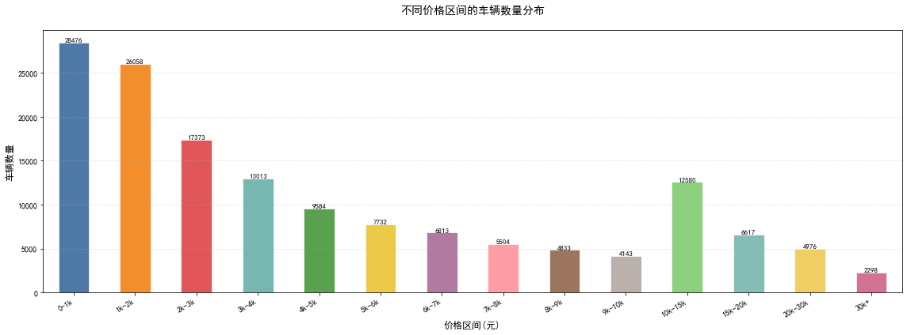
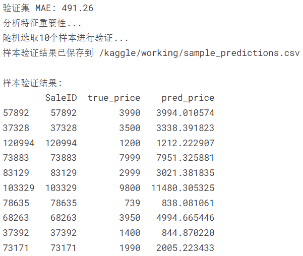
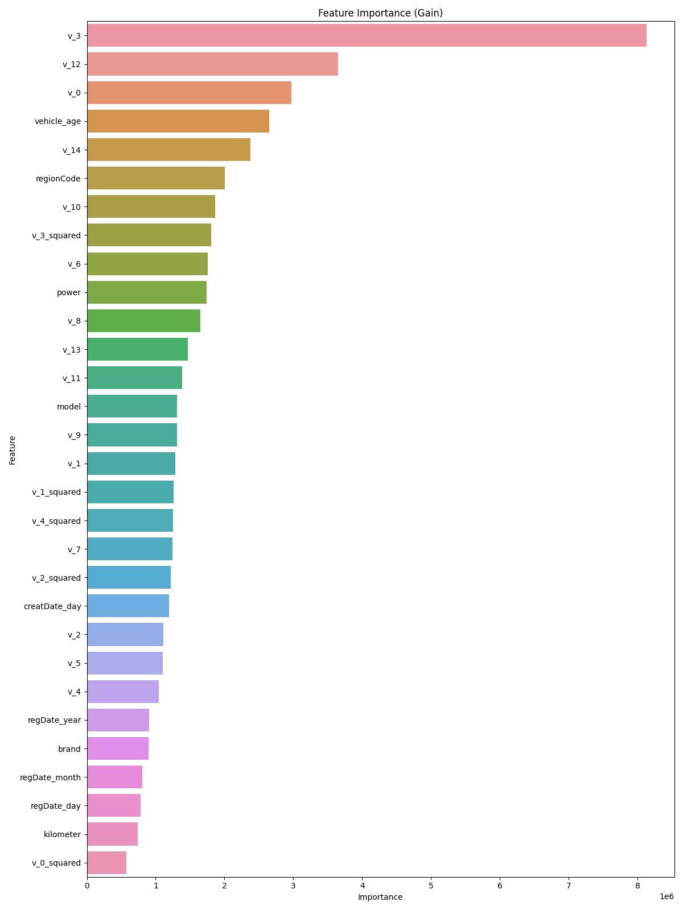

# **基于 LightGBM 的二手车价格预测**


## 项目介绍

这个项目使用机器学习技术预测二手车市场价格，基于车辆属性如品牌、型号、使用年限、行驶里程等特征构建预测模型。系统实现了完整的数据处理流程，包括：

- 数据清洗与预处理
- 特征工程
- 高级编码策略处理分类变量
- LightGBM模型训练与调优
- 模型评估与可视化

==本项目源于：[【AI入门系列】车市先知：二手车价格预测学习赛_学习赛_赛题与数据_天池大赛-阿里云天池的赛题与数据 (aliyun.com)==](https://tianchi.aliyun.com/competition/entrance/231784/information)

数据集下载：[Used_Car_Price_Prediction | Kaggle](https://www.kaggle.com/datasets/rexinshiminxiaozhou/used-car-price-prediction)

训练完成的模型下载：[ Used_Car_Price_Prediction | Kaggle](https://www.kaggle.com/models/rexinshiminxiaozhou/used_car_price_prediction)

## 数据集说明

该数据来自某交易平台的二手车交易记录，总数据量超过40w，包含31列变量信息，其中15列为匿名变量，包含两个CSV文件：

1. **训练集**：`used_car_train_20200313.csv`
   - 150,000条记录
   - 包含31个特征字段和价格标签
2. **测试集**：`used_car_testB_20200421.csv`
   - 50,000条记录
   - 包含31个特征字段，无价格标签

### 关键特征：

- `regDate`：车辆注册日期
- `creatDate`：二手车平台创建日期
- `model`：车型编码
- `brand`：品牌编码
- `bodyType`：车身类型
- `fuelType`：燃油类型
- `gearbox`：变速箱类型
- `power`：发动机功率
- `kilometer`：行驶里程
- `regionCode`：地区编码
- `price`：二手车价格（目标变量）

数据集二手车数量-价格区间：



## 文件夹结构

```bash
Used-Car-Price-Prediction/
├── README.md
├── data.ipynb                        # 数据分析文件
├── data/                             # 数据文件夹
    ├── README-data.md                # 数据说明文档
    ├── images/                       # 数据集说明图片文件夹
    ├── used_car_sample_submit.csv    # 示例提交文件
    ├── used_car_testA_20200313.csv   # 测试集A
    ├── used_car_testB_20200421.csv   # 测试集B
    └── used_car_train_20200313.csv   # 训练集
├── output/                           # 输出文件夹
    ├── feature_importance.csv        # 特征重要性分析结果
    ├── log/                          # 日志文件夹
    ├── model/                        # 模型文件夹
    ├── pic/                          # 图片输出文件夹
    └── sample_predictions.csv        # 样本预测结果
├── requirements.txt
├── train.py
└── 【AI入门系列】车市先知：二手车价格预测学习赛_学习赛_天池大赛-阿里云天池的赛制.pdf  # 比赛说明文档
```


## 模型架构与实现

### 1. 数据预处理流程

**日期特征处理：**

- 转换日期格式并提取年、月、日特征
- 处理无效日期（长度≠8或包含非数字字符）
- 计算车辆年龄：`(creatDate - regDate).dt.days / 365.25`
- 修正负车龄（设为0）

**分类特征编码：**

- 使用全局LabelEncoder确保训练/测试集编码一致性
- 处理未知类别（测试集新类别标记为'unknown'）
- 支持特征：

```python
['model', 'brand', 'bodyType', 'fuelType', 'gearbox', 
 'notRepairedDamage', 'regionCode', 'seller', 'offerType']
```

**缺失值处理：**

- 特殊值替换（如`notRepairedDamage`中的'-'→NaN）
- 中位数填充剩余缺失值

### 2. 特征工程

**核心特征：**

- 功率分桶：

```python
pd.cut(power, bins=[-inf,0,100,200,300,600,inf], labels=[0,1,2,3,4,5])
```

- 里程对数变换：`kilometer_log = np.log1p(kilometer)`
- 匿名特征组合：`v_i_squared = v_i ** 2`
- 创建日期组合特征：`creatDate_year * 100 + creatDate_month`

### 3. LightGBM模型架构

**模型参数配置：**

```python
params = {
    'objective': 'regression_l1',  # MAE损失函数
    'boosting_type': 'gbdt',
    'metric': 'mae',
    'num_leaves': 63,              # 控制模型复杂度
    'learning_rate': 0.01,          # 低学习率配合多迭代
    'feature_fraction': 0.8,        # 特征采样比例
    'bagging_fraction': 0.8,        # 数据采样比例
    'bagging_freq': 10,
    'min_data_in_leaf': 50,         # 叶子节点最小样本数
    'min_child_samples': 30,
    'reg_alpha': 0.8,               # L1正则化
    'reg_lambda': 0.8,              # L2正则化
    'max_depth': 7,                 # 树的最大深度
    'n_estimators': 150000,         # 迭代次数
    'early_stopping_round': 1000,   # 早停轮数
    'seed': 42                      # 随机种子
}
```

## 快速开始

### 环境配置

```bash
# 安装依赖
pip install -r requirements.txt
```

### 运行流程

```bash
# 1. 确保数据文件在正确路径
ls data/*.csv

# 2. 运行主程序
python train.py

# 3. 查看输出结果
ls output/
# feature_importance.png   # 特征重要性可视化
# car_price_model.pkl      # 训练好的模型
# submission.csv           # 测试集预测结果
# training_history.png     # 训练过程曲线
```


## 结果展示

模型在验证集上的MAE，以及随机选取10个样本进行测试得到的输出（更多测试样本信息请查看 *sample_predictions.csv*）：



所有指标的重要性展示如下图所示（更多指标重要性信息请查看 *feature_importance.csv*）：



战绩可查 ∠( ᐛ 」∠)_：

